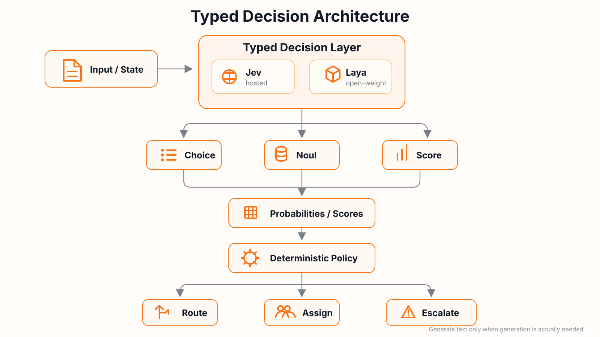

# Typed Decision Lab

[English](README.md) | [简体中文](README.zh-CN.md)

Hands-on labs for **Jev, Laya, and typed AI decision systems**.

This repository started as a TypeSafe Jev learning lab. It is expanding into a vendor-neutral place to learn a broader architecture:

<p align="center">
  
</p>

The goal is not to learn two SDKs. The goal is to understand when typed decision models are a better fit than free-form text generation, how different implementations behave, and how to build safe production workflows around them.

> Decision models make semantic judgments. Code owns policy and action.

## Systems covered

### TypeSafe Jev

A hosted typed-decision system used in the first labs. Jev is useful for learning primitives, confidence-aware automation, and production workflow design without managing model infrastructure.

### Laya

An open-weight, non-autoregressive System 1 decision model. Laya evaluates `choice`, `score`, and `noul` questions directly as probability distributions instead of generating free-form text.

- Upstream: https://github.com/NandhaKishorM/laya

### Laya-MLX

An independent Apple Silicon / MLX port of Laya. It is useful for studying local inference, runtime engineering, model parity, batching, compilation, and latency optimization.

- MLX runtime: https://github.com/mizorewww/laya-mlx

See [docs/references.md](docs/references.md) for how these projects relate.

## What you will learn

- `Choice`, `Noul`, and `Score` / `choice`, `noul`, and `score`
- How to structure state and atomic semantic questions
- Why typed decisions can be much faster than autoregressive text generation
- How to interpret probabilities and confidence without treating them as magic numbers
- Confidence-gated automation and human-review thresholds
- Speculative fan-out and parallel judgments
- Composite scoring with deterministic policy in code
- Agent and model routing
- Evaluation, calibration, and threshold tuning
- Production concerns: retries, idempotency, auditability, versioning, and observability
- Laya internals and Apple Silicon inference as advanced topics

## Learning path

The early labs use the **same problem and decision schema across Jev and Laya** whenever practical. This makes the implementation differences visible instead of hiding them behind an adapter too early.

| Lab | Topic | Main idea |
| --- | --- | --- |
| 00 | Primitive Playground | Learn the three typed-decision primitives |
| 01 | [GitHub Issue Triage](labs/01_issue_triage/) | State, instructions, semantic judgments, deterministic policy |
| 02 | DevOps Incident Triage | Fan-out and confidence gating |
| 03 | Deployment Risk Scoring | Atomic judgments and composite scoring |
| 04 | Agent / Model Router | Ranking, routing, and two-stage decisions |
| 05 | Evals & Threshold Tuning | Accuracy, calibration, coverage, thresholds |
| 06 | Production Issue Triage | Webhook → decisions → policy → actions → audit trail |
| 07 | Laya Internals | Marker scoring, decision heads, calibration, RLCD |
| 08 | Laya Runtime Engineering | PyTorch vs MLX, batching, compilation, memory, latency |

The evolving learning plan is tracked in [Issue #1](https://github.com/AndyBoWu/typed-decision-lab/issues/1).

## Why typed decisions?

A generative LLM usually solves a classification-style task by first encoding the input and then **autoregressively generating output tokens** such as an explanation or JSON object. Each output token depends on the previous output tokens, so decoding is inherently sequential.

A typed decision model can instead compute a fixed set of logits or probabilities in a forward pass:

```text
state + typed question
        ↓
semantic representation
        ↓
decision head
        ↓
probabilities / score
```

This does **not** mean the model performs no semantic analysis. The semantic computation is still there, but the system does not need to express that analysis as a token-by-token textual answer.

See [docs/why-typed-decisions.md](docs/why-typed-decisions.md) for the deeper explanation.

## Quick start

### 1. Install dependencies

This repo uses [uv](https://docs.astral.sh/uv/).

```bash
uv sync
```

### 2. Configure Jev

Create a local `.env` file from the public template:

```bash
cp .env.example .env
```

Then replace the placeholder with your real TypeSafe API key:

```dotenv
TYPESAFE_API_KEY=your-real-api-key
```

The `.env` file is ignored by Git and must never be committed.

Laya setup will be introduced alongside the first comparative lab rather than forced into the base install, because its local model/runtime dependencies are substantially heavier than the Jev SDK.

### 3. Run the current primitive lab

```bash
uv run --env-file .env python labs/00_primitives/main.py
```

## Repository principles

1. **One important concept per lab.**
2. **Runnable examples before abstraction.**
3. **Semantic judgment belongs to the decision model; deterministic policy belongs to code.**
4. **Use the same scenario across backends when comparison teaches something useful.**
5. **Do not hide Jev/Laya differences behind a common adapter too early.**
6. **Explain failure modes and trade-offs, not only happy paths.**
7. **Keep examples public-safe:** no company data, internal prompts, customer data, or secrets.
8. **English + 中文 documentation** so the material is useful to both audiences.

## References

- [TypeSafe Introduction](https://docs.typesafe.ai/introduction)
- [TypeSafe Primitives](https://docs.typesafe.ai/primitives)
- [TypeSafe Python SDK](https://docs.typesafe.ai/sdk/python)
- [Laya upstream](https://github.com/NandhaKishorM/laya)
- [Laya-MLX](https://github.com/mizorewww/laya-mlx)

## Status

- [x] Original Jev learning plan
- [x] Lab 00 — Primitive Playground (Jev)
- [x] Lab 01 — GitHub Issue Triage (Jev)
- [ ] Add Laya implementation to the primitive and issue-triage labs
- [ ] Lab 02 — DevOps Incident Triage
- [ ] Lab 03 — Deployment Risk Scoring
- [ ] Lab 04 — Agent / Model Router
- [ ] Lab 05 — Evals & Threshold Tuning
- [ ] Lab 06 — Production Issue Triage
- [ ] Lab 07 — Laya Internals
- [ ] Lab 08 — Laya Runtime Engineering
